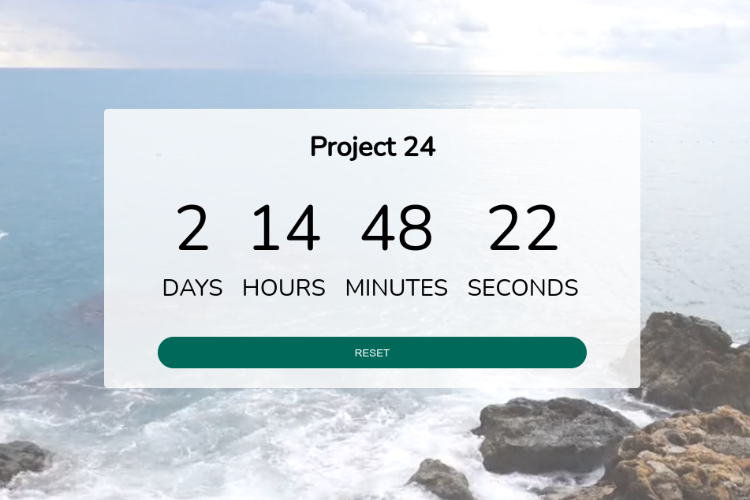

# Custom Countdown

Displays a countdown. Title and date are entered by user for something they want to countdown to. Refreshing the page will not reset the Countdown as countdown info is stored in local storage.

Live - https://overdrivemachines.github.io/custom-countdown/

## References

- Video Background - https://www.pexels.com/video/view-of-a-beautiful-horizon-1723017/
- Form Accessibility - https://developer.mozilla.org/en-US/docs/Web/Accessibility/ARIA
  - provide labels for controls
  - explicitly associate a label with its control
- Input Date - https://developer.mozilla.org/en-US/docs/Web/HTML/Element/input/date
- Submit event - https://developer.mozilla.org/en-US/docs/Web/API/HTMLFormElement/submit_event
